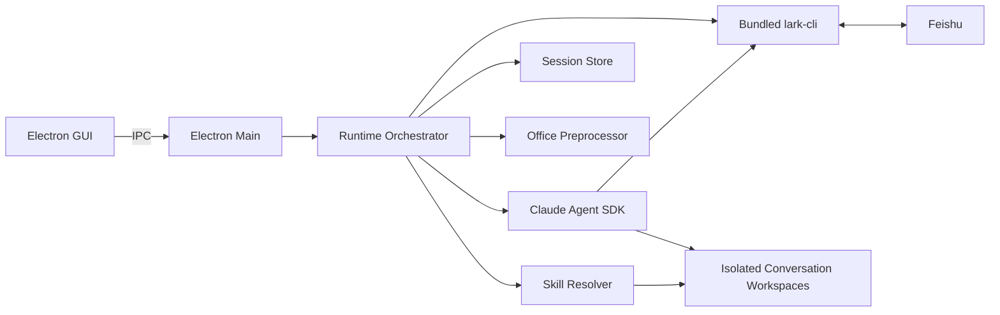
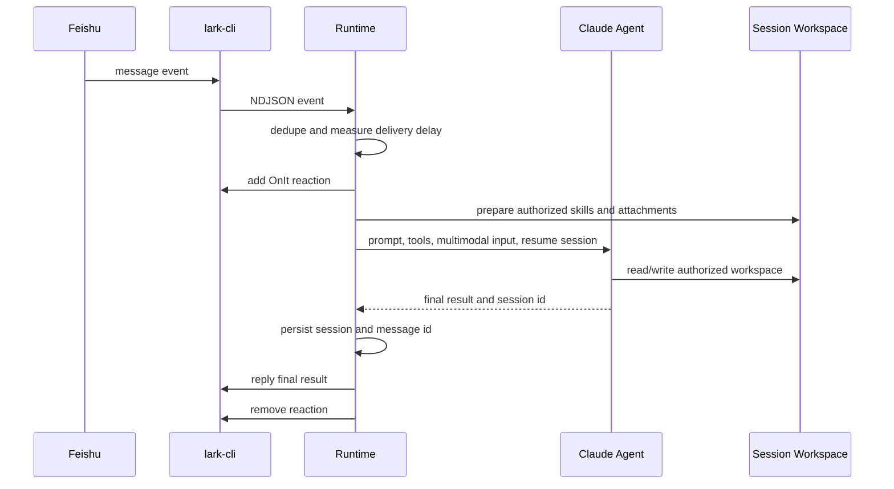

# 技术架构

## 1. 总览

QuarkfanTools 是 Electron 桌面应用。主进程负责配置、飞书监听、Skill 管理、会话编排、Claude Agent 调用和本地存储；渲染进程只通过 IPC 使用受控能力。



## 2. 消息处理流程

每个启用且配置完整的机器人维护一个 `LarkEventStream`。事件断开后等待 5 秒重连。同一连续对话内任务串行，不同对话按 `runtime.maxConcurrentTasks` 并发。



## 3. 隔离模型

机器人隔离不是只靠提示词，而是由多个边界共同实现：

- 每个机器人独立飞书 CLI 配置、日志和身份。
- 每个机器人独立 Claude home 和会话状态。
- 每个连续对话独立 workspace。
- 只把机器人获授权的 Skills 映射到当前 workspace 和 Claude home。
- Sandbox 默认拒绝访问其他机器人和全局 Skills，再放行当前 workspace、机器人状态与授权 Skills。

私聊连续会话键为 `chat_id`；群聊连续会话键为 `chat_id + sender_id`。workspace 目录名使用会话键 SHA-256 的前 24 个字符，避免将飞书标识直接作为路径。

## 4. 会话模型

- 会话记录包含 Claude `sessionId`、最近更新时间和最近最多 100 个消息 ID。
- 状态保存于 `state/bots/<bot-id>/sessions.json`。
- 无活动 24 小时后视为过期；过期会话不会恢复。
- `/new`、`新对话`、`重置会话` 会主动丢弃当前上下文。
- 只有 session/resume/not-found 类恢复错误会自动回退为新会话，避免掩盖其他模型错误。

## 5. Skill 解析

Skill 来源按优先级发现：

1. 用户导入：`workspace/skills`
2. Skill 市场：`workspace/market-skills`
3. 安装包内置：`builtin-skills`

同名 Skill 采用第一个发现的版本。支持来源根目录自身、直接子目录和一层嵌套目录中的 `SKILL.md`。开发仓库的 `skills/` 只放参考内容，不进入安装包。

## 6. Office 与多模态

- `.docx`、`.pptx`、`.xlsx` 使用内置 ZIP/XML 解析器提取为 `content.txt`。
- 单文件最多 5,000 个压缩条目，解压后总体积最多 200 MB。
- PowerPoint 在多模态开启时调用 macOS `/usr/bin/qlmanage` 生成视觉预览。
- 飞书图片消息下载后编码为模型可接收的多模态内容。

## 7. 数据目录

打包应用根目录为 `~/Library/Application Support/quarkfantools/`：

```text
config.json
state/
└── bots/<bot-id>/
    ├── lark-cli/
    ├── claude-home/
    └── sessions.json
workspace/
├── skills/
├── market-skills/
└── bots/<bot-id>/sessions/<conversation-hash>/
```

首次运行会从旧目录 `~/Library/Application Support/qah/` 迁移配置、Skills 和状态。

## 8. 关键依赖

- `@anthropic-ai/claude-agent-sdk`：Agent 运行内核
- `@larksuite/cli`：飞书事件与 API 工具
- `isomorphic-git`：无需系统 Git 的 Skill 市场
- `unzipper`、`fast-xml-parser`：Office 文件预处理
- Electron、Vite、TypeScript：桌面应用与构建
