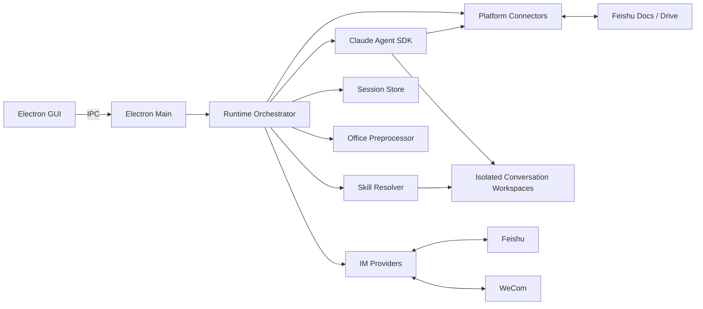
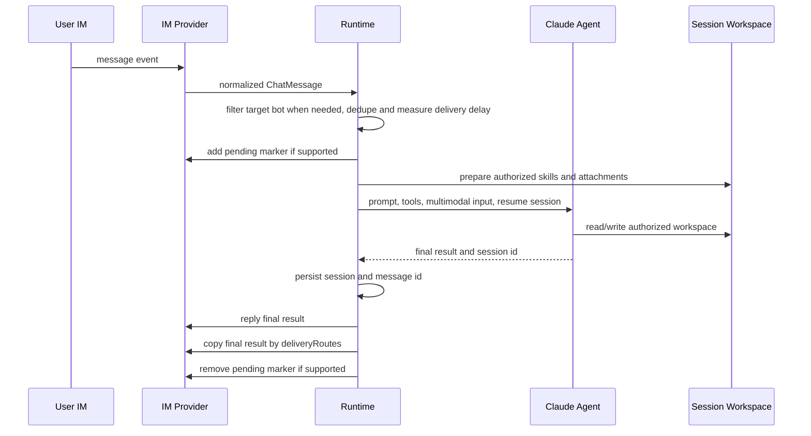

# 技术架构

## 1. 总览

QuarkfanTools 是 Electron 桌面应用。主进程负责配置、IM Provider 监听、连接器、Skill 管理、会话编排、Claude Agent 调用和本地存储；渲染进程只通过 IPC 使用受控能力。



## 2. 消息处理流程

每个启用且配置完整的机器人可被独立启动和停止，并维护自己的 IM Provider 事件流。应用以单实例运行，并为每个机器人记录订阅进程 PID；启动前会验证并清理已记录的旧订阅，应用退出时会等待监听真正停止。事件断开后等待 5 秒重连，且每个机器人最多只有一个待执行的重连定时器。同一连续对话内任务串行，不同对话通过全局 `TaskLimiter` 按 `runtime.maxConcurrentTasks` 并发，超出上限后排队。飞书主消息入口启动监听前会调用 `/open-apis/bot/v3/info` 获取当前飞书机器人的 `open_id` 和应用名，所有 lark-cli 调用使用每个 Bot 的独立 named profile。飞书群聊消息会在入队前做目标 Bot 判定：优先用 `mentions.id.open_id` 匹配当前 Bot 的真实 `open_id`，未命中的消息只记录诊断日志，不添加处理中表情、不占用队列，也不写入该 Bot 的去重集合。多飞书 Bot 同时运行时，群聊消息缺少可判定 mention 元数据会被忽略，以避免多个机器人同时回复；私聊或单飞书 Bot 旧版事件继续按原路径处理。企业微信 Provider 当前不复用飞书 mention 路由规则。



### 2.1 IM Provider、连接器和投递路由

2.0.0 起消息平台被拆成三层：

- `imProvider`：当前 Bot 的消息入口和默认回复平台。首版支持 `lark` 和 `wecom`，`dingtalk` 只保留类型和 UI 占位。
- `connectors`：外部资料和跨平台能力连接器。当前重点是 `connectors.lark`，用于企业微信 Bot 仍可读取飞书文档、Wiki、云盘和云 PPT。
- `deliveryRoutes`：最终回复复制投递规则。主回复始终回到原消息平台；额外 route 可把最终结果发送到另一个平台 chat，例如企业微信问答后同步到飞书群。

Runtime 只依赖 `electron/im-providers.ts` 的统一接口：事件流、回复、chat 投递、卡片、表情和消息资源下载。新增钉钉时应新增 provider 适配器，而不是在消息主流程中继续增加平台分支。飞书知识能力不等同于飞书消息入口；需要飞书资料时通过 `platform-connectors.ts` 解析可用的飞书主配置或独立连接器配置。

每次 Agent 会话启动或恢复前，Runtime 会在当前会话 workspace 写入：

- `CLAUDE.md`：当前 Bot、主消息平台、可用 CLI channel 和投递规则说明。
- `.quarkfan/cli-channels.json`：本 Bot 可用的隔离 CLI channel manifest，不包含明文 secret。
- `qft-cli`：Agent 使用的统一 CLI wrapper。Agent 应调用 `./qft-cli <provider> ...`，由 wrapper 路由到对应平台 CLI 和隔离环境。

官方 `wecom-cli` 是调用型工具，命令形态为 `wecom-cli <category> <method> '<json_args>'`，例如 `msg send_message`、`msg get_message`、`msg get_msg_media`。它不是飞书 `event +subscribe` 这种长连接事件 CLI；企业微信事件入口首版需要配置 `providerOptions.eventCommand` 作为输出 NDJSON 的事件桥，后续可替换为内置回调或轮询服务。

打包时会通过 `scripts/prepare-universal-wecom-cli.sh` 从官方 `@wecom/cli-darwin-arm64` 和 `@wecom/cli-darwin-x64` 平台包准备 universal `runtime/wecom-cli/bin/wecom-cli`，并作为 Electron `extraResources` 进入 arm64 与 x64 安装包。运行时代码在打包态使用 `resources/runtime/wecom-cli/bin/wecom-cli`，开发态可使用 `node_modules/.bin/wecom-cli` 或 Bot 配置的自定义 `cliPath`。

飞书事件 WebSocket 连接地址由 `lark-cli` 依赖的 `github.com/larksuite/oapi-sdk-go/v3/ws` 向飞书服务端获取，SDK 再按服务端返回的 endpoint URL 建连。日志 URL 中的 `aid`、`service_id` 等 query 参数属于飞书事件网关连接层，不等同于开放平台 `cli_...` App ID，也不参与 QuarkfanTools 的 Bot 路由。QuarkfanTools 的飞书身份治理只使用两类稳定信息：配置时的 App ID/profile 隔离，以及启动时通过 bot info 取得的 Bot `open_id`。

## 3. 隔离模型

机器人隔离不是只靠提示词，而是由多个边界共同实现：

- 每个机器人独立 IM CLI 配置、连接器配置、日志和身份。
- 每个机器人独立 Claude home 和会话状态。
- 每个连续对话独立 workspace。
- 只把机器人获授权的 Skills 映射到当前 workspace 和 Claude home。
- 2.0.0 起新增统一能力治理模型。`skillNames` 继续兼容旧 Skill 授权，新增能力通过 `capabilityRefs` 在 Bot 维度挂载；Runtime 使用 Capability Registry/Resolver 将 Skills、套件和自定义应用解析为当前 Bot 可见能力。
- Sandbox 默认拒绝访问其他机器人和全局 Skills，再放行当前 workspace、当前机器人状态与授权 Skills；当前机器人 lark-cli 的 `locks/`、`cache/` 和日志目录必须可写。
- lark-cli 的用户态 OAuth 加密材料和 `keychain-downgrade` 主密钥由官方 CLI 固定存放在 `~/Library/Application Support/lark-cli/`，Agent sandbox 需要额外允许读写该全局目录。

私聊连续会话键为 `chat_id`；群聊连续会话键为 `chat_id + sender_id`。workspace 目录名使用会话键 SHA-256 的前 24 个字符，避免将飞书标识直接作为路径。

## 4. 会话模型

- 会话记录包含 Claude `sessionId`、最近更新时间、最近最多 100 个消息 ID，以及最近最多 50 轮 transcript。新 transcript 会保存接收消息、Agent 可观察工作过程、长任务自动提示、最终回复和错误等事件；旧 transcript 只有用户输入与机器人回复正文时仍可兼容展示。
- 状态保存于 `state/bots/<bot-id>/sessions.json`。
- 无活动 24 小时后视为过期；过期会话不会恢复。
- `/new`、`新对话`、`重置会话` 会主动丢弃当前上下文。
- 只有 session/resume/not-found 类恢复错误会自动回退为新会话，避免掩盖其他模型错误。

## 5. Skill 解析

Skill 来源按优先级发现：

1. 用户导入：`workspace/skills`
2. Skill 市场：`workspace/market-skills`
3. 安装包内置：`builtin-skills`

同名 Skill 采用第一个发现的版本。支持来源根目录自身、直接子目录和一层嵌套目录中的 `SKILL.md`。发现或导入 Skill 不会授予任何机器人访问权，机器人只能使用配置中明确列出的 Skill。开发仓库的 `skills/` 只放参考内容，不进入安装包。

Skill 摘要标记为本地导入、Git 市场或应用内置。本地多个目录声明相同 frontmatter `name` 时，后续目录使用目录名作为显示名，避免被去重隐藏。用户只能从 GUI 删除本地导入且未被任何机器人授权使用的 Skill；已授权 Skill 必须先在 Bot 配置中取消授权。

机器人可配置 Owner open_id。Agent 仅通过结构化 `OWNER_ESCALATION` 结果发起人工升级；Runtime 将请求持久化并私聊 Owner 发送卡片。只有配置的 Owner 本人发出的 `/owner` 处理指令会被接受，处理结果回复到原消息。

## 5.1 能力与自定义应用

能力目录目前由 Skills、套件、套件派生 Workflow、自定义应用和 MCP 组成，命令和定时任务已开始复用同一治理边界。能力定义和 Bot 授权引用分离：

- `CapabilityDefinition` 表示全局可发现能力。
- `BotCapabilityRef` 表示某 Bot 对某能力的挂载授权和 policy。
- Capability Resolver 会把旧 `skillNames` 转换为 `kind=skill` 的能力引用，并合并新 `capabilityRefs`。
- `ExecutableCapabilityBinding Resolver` 负责把 `kind=id` 的能力引用解析为具体可执行绑定，并在此处收口 trigger policy、套件上下文和可调用面校验。
- 统一执行分派由 `electron/capability-executor.ts` 承担，负责把 Skill / 套件 / Workflow / 自定义应用 capability 绑定到 Claude Agent 或 app runner。

MCP 诊断分两层：页面初始加载只执行静态检查，包括启用状态、命令解析、cwd、环境变量和 Bot 授权；用户手动刷新诊断时，主进程会对静态检查通过的 `stdio` MCP 做短生命周期协议探测，执行 `initialize` 和 `tools/list`，把工具名摘要、退出码、signal 和 stderr 尾部返回渲染层后关闭进程。探测结果只用于配置可观测性，不作为 Bot 授权来源。

套件位于 `workspace/suites/<suite-id>/`，必须包含 `suite.json`。当前版本支持导入、发现、预览和 Bot 挂载授权，作为角色化、行业化能力包进入统一目录。套件挂载本身不直接执行代码，也不自动授予底层 Skill、自定义应用或 MCP 权限；Runtime 会先按底层能力授权求交集，再把套件说明、工作流以及套件内已获授权的 Skill、自定义应用和 MCP 摘要注入当前 Agent 上下文。

套件中的每个 `workflow` 当前会派生为一个 `kind=workflow` 的可执行能力，ID 形如 `<suite-id>/<workflow-id>`。Workflow 授权跟随套件挂载，不额外增加一层 Bot 勾选；执行时会复用套件的 Skill 集合和上下文。没有 `steps` 的 Workflow 会把 workflow prompt 作为当前任务的强约束前缀；声明了 `steps` 的 Workflow 会由 executor 顺序执行 prompt step 或 capability step，并把上一步输出传给下一步。

Workflow 执行时会发出步骤事件。Runtime 会把每个步骤的开始、完成、失败、输出摘要或错误摘要写入运行台日志；当 Workflow 由定时任务触发时，步骤摘要还会附加到 `scheduled-runs.jsonl` 的 `detail` 字段，便于后续排障和治理审计。

自定义应用位于 `workspace/apps/<app-id>/`，必须包含 `app.json`。当前已接入命令和定时任务调用链路：Bot 编辑器中的命令映射可将 `/xxx` 路由到已授权且声明 `commandCallable` 的自定义应用；定时任务 capability 目标可调用已授权且声明 `scheduledCallable` 的自定义应用。运行时会在当前 Bot 当前会话的 `workspace/bots/<bot-id>/sessions/<conversation-hash>/apps/<app-id>/` 下创建独立执行目录，并通过 JSON stdin/stdout 协议交换输入输出。Agent 主动直接调用自定义应用仍保留为后续 Runtime Binding 扩展点，不在消息主流程中继续增加平铺分支。

MCP 服务定义保存在全局配置 `config.mcpServers`，当前支持 `stdio` 类型。运行时只会把当前 Bot 已授权且启用的 MCP 传给 Claude Agent SDK，并启用 `strictMcpConfig`，忽略项目目录、用户目录和其他磁盘来源的 MCP 配置。

MCP 诊断由主进程通过只读 IPC 暴露给渲染层。诊断不会启动长期 MCP 会话，只检查当前配置的启用状态、命令是否能在 `cwd` 或 `PATH` 中解析、`cwd` 是否可读、环境变量是否缺值，以及该 MCP 已授权给哪些 Bot。能力页据此展示 `OK/WARN/ERROR`，用于在真正进入 Agent 前发现配置问题。

命令机制位于消息主流程的资源准备之后、通用 Agent 调用之前：

- Runtime 先解析 `/name args`，并保留 `/new`、`/continue`、`/owner` 为系统保留命令。
- Bot 的 `commandBindings` 只允许映射到当前 Bot 已授权能力。
- Skill 命令会以绑定后的 prompt 只调用目标 Skill。
- Suite 命令会把绑定后的 prompt 交给 Agent，并只注入目标套件的上下文摘要；可用 Skill 集合优先收敛到该套件声明且当前 Bot 已授权的 Skills。
- Workflow 命令会复用父套件的上下文和 Skill 收敛结果；简单 Workflow 把 workflow prompt 与用户输入合并后交给 Agent，声明式 Workflow 则按步骤顺序执行。
- App 命令会校验 `commandCallable` 与 Bot policy，再直接执行目标自定义应用。
- `promptTemplate` 支持 `{{args}}`，用于把命令参数整理成稳定输入格式。

定时任务运行时由主进程调度器维护：

- `BotConfig.scheduledTasks` 保存任务定义，状态目录保存 `scheduled-tasks.json` 镜像和 `scheduled-runs.jsonl` 运行记录。
- 任务触发时使用独立 conversation key `scheduled:<task-id>`，避免污染私聊或群聊连续会话。
- `command` 目标会复用现有命令执行链；`capability` 目标当前支持 Skill、套件、Workflow 和支持 `scheduledCallable` 的自定义应用；`agent` 目标复用当前 Bot 的通用 Skill 集合。
- 直接 capability 调用与命令调用共享统一执行分派：Skill/Suite 走 Claude Agent，自定义应用走受控 app runner；定时任务会额外校验 `allowScheduledUse` policy。
- 定时任务与普通消息共享 `TaskLimiter` 并发上限。
- 用户可手动立即运行已保存且启用的任务；手动运行复用同一执行链路和审计记录，但保留原本已计算的下一次计划时间，避免打乱自动调度节奏。
- 主进程通过只读 IPC 汇总各 Bot 的 `scheduled-runs.jsonl` 最近记录，渲染层在存储管理中展示任务名、Bot、状态、耗时和详情。该历史用于治理审计，不参与会话清理或文件缓存清理。

日志条目可包含结构化 `botId`。运行台使用该字段按机器人隔离展示详细日志，并可按等级筛选；不属于机器人的应用级日志仍保留为全局日志。

飞书应用可能向同一 Bot 长连接投递已在开放平台启用、但当前 `lark-cli event +subscribe` 未注册处理器的表情事件。应用自身添加和移除处理中表情时也会触发这类事件。Runtime 只消费 `im.message.receive_v1`，并过滤 reaction created/deleted 的 `not found handler` SDK 噪声；其他连接错误仍写入日志。

消息处理启动后，添加处理中表情与资源准备、Agent 启动并行执行，不再阻塞模型调用。授权 Skill 到机器人 Claude home 和会话 workspace 的链接同步也并行执行。每条成功回复额外记录资源处理、Agent、飞书回复与总耗时，用于区分本机准备、模型服务和飞书 API 延迟。

应用版本从 Electron `app.getVersion()` 读取。面向用户的更新记录维护在 `electron/release-notes.ts`，通过受控 IPC 提供给渲染层版本弹窗；根 `CHANGELOG.md` 保留更完整的开发和发布记录。

lark-cli 凭据 marker 只用于避免重复初始化；应用进程首次使用机器人身份时仍执行 `config show` 校验。若实际配置或密钥链状态丢失，会使用已保存的 App ID 与 App Secret 自动重新初始化。主进程随后执行官方 `keychain-downgrade`，将密钥物化为 Claude sandbox 内的 lark-cli 也能读取的本地文件。用户态 OAuth 只能从应用配置页发起，Agent 不在会话内执行 `auth login` 或要求普通用户扫码。

事件监听、消息回复和表情操作分别使用机器人配置的接收与回复身份。Agent 查找和读取飞书文档、Wiki、云盘与云 PPT 时固定使用已 OAuth 授权的用户态；云 PPT 使用 `drive +export` 导出为 PPTX，而不是按普通文件下载。用户态 OAuth 默认申请文档搜索权限，并按 Bot 合并用户配置的额外 scope。macOS Claude sandbox 使用网络代理限制外部访问，同时允许访问系统 trustd，使 Go 编写的 lark-cli 能校验代理 TLS 证书。文件隔离按 Bot 目录精确拒绝其他 Bot，而不是拒绝整个 `state/bots` 后再回放行当前 Bot，避免 lark-cli 锁文件写入被拦截。由于官方 lark-cli 没有提供可验证的独立安全存储目录配置，sandbox 同时允许 `~/Library/Application Support/lark-cli/` 读写，以读取用户态 OAuth 加密凭据和降级后的主密钥。

## 6. Office 与多模态

- `.docx`、`.pptx`、`.xlsx` 使用内置 ZIP/XML 解析器提取为 `content.txt`。
- 单文件最多 5,000 个压缩条目，解压后总体积最多 200 MB。
- PowerPoint 在多模态开启时调用 macOS `/usr/bin/qlmanage` 生成视觉预览。
- 飞书图片消息下载后编码为模型可接收的多模态内容。

## 7. 数据目录

打包应用根目录为 `~/Library/Application Support/quarkfantools/`：

```text
config.json
state/
├── file-cache/<sha256>/
└── bots/<bot-id>/
    ├── lark-cli/
    ├── claude-home/
    ├── deferred-tasks.json
    └── sessions.json
workspace/
├── skills/
├── apps/
├── suites/
├── market-skills/
└── bots/<bot-id>/sessions/<conversation-hash>/
```

首次运行会从旧目录 `~/Library/Application Support/qah/` 迁移配置、Skills 和状态。

延后下载任务由 Agent 使用结构化 `DEFERRED_DOWNLOAD` 结果创建，Runtime 按机器人持久化。用户回复 `/continue <id>` 后，任务进入现有会话串行队列并沿用原 Claude 会话继续处理。消息附件和 Agent 在会话 workspace 中下载或生成的文件会进入应用级全局文件缓存 `state/file-cache/<sha256>/`，使用内容 SHA-256 去重，只由应用主进程管理；元数据记录获准使用该缓存内容的 Bot，Agent 不直接获得全局缓存目录访问权。飞书消息附件下载前会按 Bot 和资源 key 查询缓存索引，命中后复制到当前消息目录。

Agent 需要下载飞书云盘文件或导出云文档继续分析时，可最终输出 `LARK_CACHED_FILE` 结构化请求。Runtime 解析后在主进程中执行受控 helper：先按 Bot、file token、doc type、扩展名和可选 freshness key 查询文件缓存，命中则复制到当前消息目录；未命中才用当前 Bot 的用户态 `lark-cli drive +download` 或 `drive +export` 获取文件，写入缓存后再把本地路径回灌给同一 Claude 会话继续分析。该路径覆盖云盘文件下载和云文档导出首版。Claude SDK 流中的 Bash tool use 会检测裸 `lark-cli drive +download` 和 `drive +export`，命中后中止任务并回复治理提示，避免大文件绕过下载前缓存。存储管理会只读展示文件缓存索引，包含来源类型、关联 Bot、文件名、大小和来源摘要，并支持按 Bot 和来源筛选；界面不暴露全局缓存目录路径。会话清理和文件缓存清理在 UI 中分开执行。

用户可见工作过程仅从 SDK 的工具调用和重试事件生成，并限频发送。模型的 thinking block、隐藏推理和原始工具参数不向用户输出。

## 8. 关键依赖

- `@anthropic-ai/claude-agent-sdk`：Agent 运行内核
- `@larksuite/cli`：飞书事件与 API 工具
- `isomorphic-git`：无需系统 Git 的 Skill 市场
- `unzipper`、`fast-xml-parser`：Office 文件预处理
- Electron、Vite、TypeScript：桌面应用与构建
