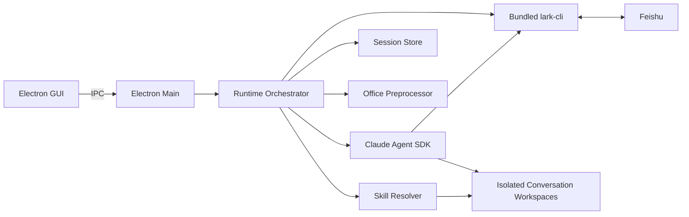
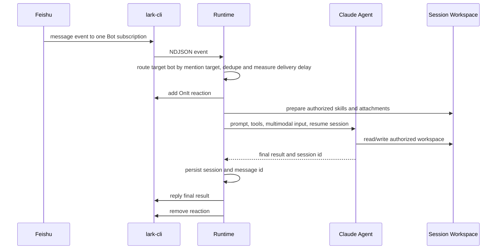

# 技术架构

## 1. 总览

QuarkfanTools 是 Electron 桌面应用。主进程负责配置、飞书监听、Skill 管理、会话编排、Claude Agent 调用和本地存储；渲染进程只通过 IPC 使用受控能力。



## 2. 消息处理流程

每个启用且配置完整的机器人可在 UI 中独立启动和停止，并使用该 Bot 专属 `HOME`、named profile 和状态目录启动自己的 `LarkEventStream`。`v1.6.16` 曾尝试把同一应用进程内的飞书事件收敛为单共享入口，以规避官方 `lark-cli event +subscribe --force` 提到的多连接随机拆分风险；客户 Intel 环境验证发现单共享入口可能只覆盖后启动 Bot 所属飞书应用，导致其他 Bot 收不到自身事件。因此 `v1.6.17` 起恢复每 Bot 隔离订阅，但保留 Runtime 统一目标路由：任何订阅收到 NDJSON 事件后，都会按 mention 目标路由到唯一目标 Bot。这样每个飞书应用至少能通过自己的订阅接收事件；如果服务端仍交叉投递到其他 Bot 的连接，应用也会跨 Bot 路由到被艾特 Bot。`v1.6.18` 起，目标 Bot 的处理去重同时记录飞书 `event_id` 和稳定的 `message_id`，避免同一条消息被多个订阅投递且 `event_id` 不同时连续回复两次。应用以单实例运行，并按 Bot 记录订阅进程 PID；启动前会验证并清理该 Bot 已记录的旧订阅，应用退出时会等待监听真正停止。事件断开后当前 Bot 等待 5 秒重连，且每个 Bot 最多只有一个待执行的重连定时器。同一连续对话内任务串行，不同对话通过全局 `TaskLimiter` 按 `runtime.maxConcurrentTasks` 并发，超出上限后排队。启动监听前会调用 `/open-apis/bot/v3/info` 获取当前飞书机器人的 `open_id` 和应用名，所有回复、表情、附件下载和 Agent 内 lark-cli 调用仍使用目标 Bot 的独立 named profile。群聊消息会在入队前做目标 Bot 判定：有 `mentions` 元数据时，只用 mention 目标值匹配运行中 Bot 的配置 App ID、Bot 名、bot info 应用名和可用 open_id；`mentions.id.open_id` 只作为命中的正向信号，不作为排他条件，因为飞书群聊 mention 事件里的 open_id 可能不是 `/open-apis/bot/v3/info` 返回的 Bot open_id。事件头 `sourceAppId` 表示当前监听连接所属应用，有 mention 时不参与目标路由；仅在缺少 mention 元数据的旧事件中作为兜底。未命中的消息只记录带判定原因的忽略日志，不添加处理中表情、不占用队列，也不写入该 Bot 的去重集合。多 Bot 同时运行时，群聊消息缺少可判定 mention 元数据会被忽略，以避免多个机器人同时回复；私聊或单 Bot 旧版事件继续按原路径处理。

同一飞书 App ID 同一时间只能启动一个本地 Bot。飞书事件属于开放平台应用而不是 QuarkfanTools 内部 Bot 配置；如果两个本地 Bot 复用同一个 App ID，它们会收到同一条机器人事件，应用层无法可靠判断用户想调用哪个本地角色。因此多 Bot 隔离要求每个运行中的 Bot 使用不同飞书应用；同一飞书应用内的多角色能力应由 Skill、命令或套件在单个 Bot 内路由。

飞书事件 WebSocket 连接地址由 `lark-cli` 依赖的 `github.com/larksuite/oapi-sdk-go/v3/ws` 向飞书服务端获取，SDK 再按服务端返回的 endpoint URL 建连。日志 URL 中的 `aid`、`service_id` 等 query 参数属于飞书事件网关连接层，不等同于开放平台 `cli_...` App ID，也不参与 QuarkfanTools 的 Bot 路由。QuarkfanTools 的身份治理使用配置时的 App ID/profile 隔离、启动时通过 bot info 取得的 Bot `open_id` 和应用名，以及事件 mention 中的展示名、应用 ID 和 open_id 等目标值；其中 mention open_id 只能做正向匹配，不能用来否定同名或同应用名命中的 Bot。



## 3. 隔离模型

机器人隔离不是只靠提示词，而是由多个边界共同实现：

- 每个机器人独立飞书 CLI 配置、日志和身份。
- 每个机器人独立 Claude home 和会话状态。
- 每个连续对话独立 workspace。
- 只把机器人获授权的 Skills 映射到当前 workspace 和 Claude home。
- Sandbox 默认拒绝访问其他机器人和全局 Skills，再放行当前 workspace、当前机器人状态与授权 Skills；当前机器人 lark-cli 的 `locks/`、`cache/`、日志目录和 Bot 专属 HOME 下的安全存储必须可写。
- 所有 lark-cli 子进程都会设置当前 Bot 专属 `HOME=state/bots/<bot-id>/lark-home`。因此用户态 OAuth 加密材料和 `keychain-downgrade` 主密钥落在 `state/bots/<bot-id>/lark-home/Library/Application Support/lark-cli/`，不再使用真实 macOS 用户全局 `~/Library/Application Support/lark-cli/`。

私聊连续会话键为 `chat_id`；群聊连续会话键为 `chat_id + sender_id`。workspace 目录名使用会话键 SHA-256 的前 24 个字符，避免将飞书标识直接作为路径。

## 4. 会话模型

- 会话记录包含 Claude `sessionId`、最近更新时间和最近最多 100 个消息 ID。
- 状态保存于 `state/bots/<bot-id>/sessions.json`。
- 无活动 24 小时后视为过期；过期会话不会恢复。
- `/new`、`新对话`、`重置会话` 会主动丢弃当前上下文。
- 只有 session/resume/not-found 类恢复错误会自动回退为新会话，避免掩盖其他模型错误。

## 5. Skill 解析

Skill 来源按优先级发现：

1. 用户导入：`workspace/skills`
2. Skill 市场：`workspace/market-skills`
3. 安装包内置：`builtin-skills`

同名 Skill 采用第一个发现的版本。支持来源根目录自身、直接子目录和一层嵌套目录中的 `SKILL.md`。发现或导入 Skill 不会授予任何机器人访问权，机器人只能使用配置中明确列出的 Skill。开发仓库的 `skills/` 只放参考内容，不进入安装包。

Skill 摘要标记为本地导入、Git 市场或应用内置。本地多个目录声明相同 frontmatter `name` 时，后续目录使用目录名作为显示名，避免被去重隐藏。用户只能从 GUI 删除本地导入且未被任何机器人授权使用的 Skill；已授权 Skill 必须先在 Bot 配置中取消授权。

机器人可配置 Owner open_id。Agent 仅通过结构化 `OWNER_ESCALATION` 结果发起人工升级；Runtime 将请求持久化并私聊 Owner 发送卡片。只有配置的 Owner 本人发出的 `/owner` 处理指令会被接受，处理结果回复到原消息。

日志条目可包含结构化 `botId`。运行台使用该字段按机器人隔离展示详细日志，并可按等级筛选；不属于机器人的应用级日志仍保留为全局日志。

飞书应用可能向同一 Bot 长连接投递已在开放平台启用、但当前 `lark-cli event +subscribe` 未注册处理器的表情事件。应用自身添加和移除处理中表情时也会触发这类事件。Runtime 只消费 `im.message.receive_v1`，并过滤 reaction created/deleted 的 `not found handler` SDK 噪声；其他连接错误仍写入日志。

消息处理启动后，添加处理中表情与资源准备、Agent 启动并行执行，不再阻塞模型调用。授权 Skill 到机器人 Claude home 和会话 workspace 的链接同步也并行执行。每条成功回复额外记录资源处理、Agent、飞书回复与总耗时，用于区分本机准备、模型服务和飞书 API 延迟。

应用版本从 Electron `app.getVersion()` 读取。面向用户的更新记录维护在 `electron/release-notes.ts`，通过受控 IPC 提供给渲染层版本弹窗；根 `CHANGELOG.md` 保留更完整的开发和发布记录。

lark-cli 凭据 marker 只用于避免重复初始化；应用进程首次使用机器人身份时仍执行 `config show` 校验。若实际配置或密钥链状态丢失，会使用已保存的 App ID 与 App Secret 自动重新初始化。主进程随后在 Bot 专属 HOME 中执行官方 `keychain-downgrade`，将密钥物化为 Claude sandbox 内的 lark-cli 也能读取的本地文件。启动前置阶段会记录“收到启动请求”和“正在确认飞书 Bot 身份”，`config show`、`config init` 和 `keychain-downgrade` 等短命令有 30 秒超时，避免 CLI 卡住时界面无反馈。用户态 OAuth 只能从应用配置页发起，Agent 不在会话内执行 `auth login` 或要求普通用户扫码。

事件监听、消息回复和表情操作分别使用机器人配置的接收与回复身份。Agent 查找和读取飞书文档、Wiki、云盘与云 PPT 时固定使用已 OAuth 授权的用户态；云 PPT 使用 `drive +export` 导出为 PPTX，而不是按普通文件下载。用户态 OAuth 默认申请文档搜索权限，并按 Bot 合并用户配置的额外 scope。macOS Claude sandbox 使用网络代理限制外部访问，同时允许访问系统 trustd，使 Go 编写的 lark-cli 能校验代理 TLS 证书。文件隔离按 Bot 目录精确拒绝其他 Bot，而不是拒绝整个 `state/bots` 后再回放行当前 Bot，避免 lark-cli 锁文件、安全存储和降级密钥写入被拦截。

## 6. Office 与多模态

- `.docx`、`.pptx`、`.xlsx` 使用内置 ZIP/XML 解析器提取为 `content.txt`。
- 单文件最多 5,000 个压缩条目，解压后总体积最多 200 MB。
- PowerPoint 在多模态开启时调用 macOS `/usr/bin/qlmanage` 生成视觉预览。
- 飞书图片消息下载后编码为模型可接收的多模态内容。

## 7. 数据目录

打包应用根目录为 `~/Library/Application Support/quarkfantools/`：

```text
config.json
state/
├── file-cache/<sha256>/
└── bots/<bot-id>/
    ├── lark-cli/
    ├── lark-home/
    ├── claude-home/
    ├── deferred-tasks.json
    └── sessions.json
workspace/
├── skills/
├── market-skills/
└── bots/<bot-id>/sessions/<conversation-hash>/
```

首次运行会从旧目录 `~/Library/Application Support/qah/` 迁移配置、Skills 和状态。

延后下载任务由 Agent 使用结构化 `DEFERRED_DOWNLOAD` 结果创建，Runtime 按机器人持久化。用户回复 `/continue <id>` 后，任务进入现有会话串行队列并沿用原 Claude 会话继续处理。消息附件和 Agent 在会话 workspace 中下载或生成的文件会进入全局文件缓存，使用内容 SHA-256 去重，只由应用主进程管理；元数据记录获准使用该缓存内容的 Bot，Agent 不直接获得全局缓存目录访问权。

用户可见工作过程仅从 SDK 的工具调用和重试事件生成，并限频发送。模型的 thinking block、隐藏推理和原始工具参数不向用户输出。

## 8. 关键依赖

- `@anthropic-ai/claude-agent-sdk`：Agent 运行内核
- `@larksuite/cli`：飞书事件与 API 工具
- `isomorphic-git`：无需系统 Git 的 Skill 市场
- `unzipper`、`fast-xml-parser`：Office 文件预处理
- Electron、Vite、TypeScript：桌面应用与构建
