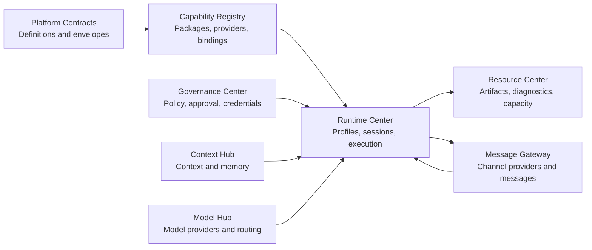

# Platform Extensibility Architecture

Status: implemented platform baseline for QuarkfanTools 3.x/5.x.

## 1. Decision

QuarkfanTools will use a distributed extension model based on four explicit roles:

1. **Definition**: versioned public contract describing what a capability is.
2. **Provider**: implementation that declares and supplies the capability.
3. **Binding**: tenant, Bot, profile or policy-specific selection and configuration.
4. **Consumer**: center or runtime that invokes the resolved capability.

The roles may be packaged together for a built-in feature, but they remain separate in contracts, identity, lifecycle and audit. A manifest is not an implementation; an installed provider is not automatically authorized; a binding is not a copied provider configuration.

This design applies to runtime engines, model backends, channel adapters, context sources/processors, capability executors, storage backends, browser/media workers and future extension families.

## 2. Non-negotiable invariants

- Public contracts are versioned independently from provider versions.
- Every provider declares static capabilities and supports a dynamic health/capability probe when the external system can vary.
- Unsupported requested behavior is rejected before execution starts. Silent fallback is forbidden unless a visible policy explicitly allows it.
- Provider configuration contains credential references, never secret values.
- Install, upgrade, activate, drain, rollback and dispose are owned lifecycle operations.
- Visibility, authorization and execution resolve from the same immutable binding snapshot.
- Every model-visible input and output is attributable to a durable session event or a cited immutable resource.
- Center-owned domain state stays in its owning center. Extension does not mean cross-center database access.
- All provider families have a shared contract suite and failure-injection tests.

## 3. Control plane and execution plane

The control plane manages definitions, provider packages, bindings, profiles, policies, rollout state and diagnostics. The execution plane runs immutable resolved snapshots.



Runtime Center snapshots the selected Runtime Profile at session or execution admission. Later configuration changes affect new work unless an explicit migration operation moves a live session.

## 4. Provider contract

Every provider family specializes the following common descriptor:

```ts
interface ProviderDescriptor {
  providerId: string;
  family: string;
  version: string;
  contractVersion: string;
  capabilities: Record<string, boolean | string | number>;
  isolation: "in-process" | "worker" | "process" | "container" | "remote";
  configurationSchemaRef: string;
  credentialKinds: string[];
}

interface ProviderRef {
  providerId: string;
  versionConstraint?: string;
  bindingId?: string;
}

interface ProviderProbe {
  status: "ready" | "degraded" | "unavailable" | "incompatible";
  observedCapabilities: Record<string, boolean | string | number>;
  checkedAt: string;
  reason?: string;
}
```

Provider-family contracts add typed operations. Runtime providers add `start`, `resume`, `cancel` and `dispose`; context processors add `prepare`, `transform` and `checkpoint`; channel providers add receive, resolve and send operations. Cross-center calls use Platform Contracts envelopes and idempotency keys.

## 5. Runtime Profile

A Runtime Profile is declarative composition, not executable plugin code:

```ts
interface RuntimeProfile {
  profileId: string;
  revision: number;
  runtimeProvider: ProviderRef;
  modelPolicyRef: string;
  contextPolicyRef: string;
  capabilityBindingSetRef: string;
  governancePolicyRef: string;
  workspacePolicyRef: string;
  promptSectionRefs: string[];
  limits: Record<string, number | boolean | string>;
}
```

The resolved snapshot includes exact provider versions, capability IDs and revisions, model policy revision, context citations, governance decision references and workspace allocation. This makes replay and incident review possible without assuming current configuration matches historical configuration.

## 6. Session Event Ledger

Runtime Center owns a per-session append-only event ledger. It replaces mutable message history as the source of truth.

Required event families include:

- `session/created`, `session/profile-resolved`, `session/migrated`
- `turn/started`, `turn/ended`
- `input/accepted`, `context/materialized`, `prompt/materialized`
- `model/requested`, `model/chunk`, `model/completed`
- `capability/requested`, `capability/approved`, `capability/completed`
- `execution/suspended`, `execution/resumed`, `execution/cancelled`, `execution/failed`
- `projection/checkpointed`, `compaction/materialized`

Events carry session sequence, event ID, tenant and Bot scope, trace/request IDs, schema version, timestamp, producer and payload/resource references. Large or sensitive payloads live in Resource Center or the owning center; events store immutable references and redacted metadata.

Projections produce:

- model request history;
- user transcript and Dashboard timeline;
- execution status and usage;
- continuation state;
- context and capability audit views.

Retention does not truncate the source ledger by array length. Policy may archive payloads, checkpoint projections or compact model-visible history while preserving source attribution and deletion/audit obligations.

## 7. Governed capability pipeline

Runtime adapters may request capabilities but may not implement independent authorization paths. Every invocation follows one pipeline:

1. Resolve the immutable CR binding snapshot.
2. Filter visibility by tenant, Bot, runtime profile and trigger scope.
3. Ask Governance for policy and approval requirements.
4. Validate input, risk, quotas and provider health.
5. Dispatch to the selected provider or isolated worker.
6. Normalize output and resource references.
7. Apply post-policy, redaction and audit.
8. Append durable capability events.

The tool schemas shown to a model and the execution resolver use the same snapshot. Parallel or exclusive execution is declared by the capability/provider and results are committed in deterministic call order.

## 8. Center ownership

| Center              | Extension ownership                                                                               |
| ------------------- | ------------------------------------------------------------------------------------------------- |
| Platform Contracts  | Common descriptors, refs, event envelopes and compatibility rules                                 |
| Capability Registry | Capability definitions, provider packages, versions, bindings, trust metadata and diagnostics     |
| Runtime Center      | Runtime providers, Runtime Profiles, session ledger, projections and execution pipeline           |
| Context Hub         | Context source/processor providers, retrieval, compaction artifacts and memory lifecycle          |
| Model Hub           | Model provider adapters, deployments, routing and model capability negotiation                    |
| Message Gateway     | Channel provider adapters, accounts, inbound/outbound normalization and channel capability probes |
| Governance Center   | Authorization, approval, credentials, sandbox policy and audit decisions                          |
| Resource Center     | Resource backends, artifacts, diagnostic bundles, capacity and retention execution                |
| Scheduler Center    | Durable triggers, work admission, retries and continuation scheduling                             |
| Platform Deployment | Packaging, rollout, canary, rollback, compatibility and release manifests                         |

## 9. Migration from the current implementation

### Phase A: contracts and compatibility

- Add common provider, binding and event contracts to Platform Contracts.
- Wrap existing runtime adapters behind `RuntimeProvider` without changing behavior.
- Introduce a compatibility profile for current Bot definitions.
- Add contract suites before accepting new providers.

### Phase B: ledger and projections

- Dual-write current execution events and the new Session Event Ledger.
- Build transcript/model-history projections and compare them in shadow mode.
- Stop truncating the mutable session array after replay equivalence is proven.
- Migrate existing sessions with explicit provenance and a legacy-import event.

### Phase C: one capability pipeline

- Move tool schema resolution and dispatch policy out of individual runtime adapters.
- Make CR resolution, Governance decision and Runtime dispatch share one snapshot ID.
- Add deterministic concurrency, approvals, cancellation and structured failure events.

### Phase D: provider lifecycle

- Add install/verify/canary/activate/drain/rollback APIs and Dashboard views.
- Move high-risk or native providers into workers/processes/containers.
- Add compatibility matrices and automated upgrade gates.

### Phase E: advanced composition

- Add profile revisions, controlled session migration and provider-specific projections.
- Add CH compaction processors, sub-runtime delegation and remote runtime providers only after the base invariants pass.

## 10. Architecture gates

No extension family is complete until it has:

- definition, provider, binding and consumer contracts;
- version and capability negotiation;
- health, list, status, detail and logs management surfaces;
- install/upgrade/rollback and disposal semantics;
- authorization and credential-reference integration;
- isolation and resource limits appropriate to its risk;
- durable events and audit correlation;
- contract, replay, fault, cancellation and lifecycle tests;
- deployment, rollback and handoff documentation.

## 11. Open-source decision

DeepSeek Harness is the primary reference for runtime composition, session invariants, tool execution and extension testing at commit `47f9438`.

We will adopt DeepSeek's Cordis Core as a controlled Runtime-internal plugin kernel behind the QuarkfanTools Plugin SDK. It is exact-version pinned, limited to reviewed in-process adapters, and cannot cross center contracts or replace process/container isolation. Production loader/HMR and arbitrary runtime package installation remain disabled. The full DeepSeek Harness may later be integrated as an isolated Runtime Provider through the same provider contracts.

This split captures the plugin architecture without making the harness's large, rapidly changing package graph the platform core. Detailed evidence, supply-chain caveats and promotion gates live in `Runtime-Center/docs/cordis-adoption.md` and the parent reference evaluation.

## 12. Implemented production surface

As of 2026-08-16, the production execution path is composed as `CordisPluginKernel -> RuntimeProviderRegistry -> RuntimeProvider`. The three existing engines are built-in Provider plugins rather than entries in a startup adapter map. Existing Bot `runtime` values are admitted through generated compatibility Profiles; new Bots can bind to revisioned Runtime Profiles.

Runtime persists Provider lifecycle state, Profile revisions, immutable admission snapshots and an append-only per-session event ledger. Model Tool Loop and OpenAI Agents use one `CapabilityFacade`, so model-visible schemas and executable handles come from the same admitted capability snapshot. Claude Code remains a distinct Provider because its SDK owns its inner loop; read-only executions now remove write/edit/shell tools, and its remaining provider-specific capability limitations are declared rather than hidden.

MG, CH, MH, CR, Scheduler, Resource and Governance expose the same extension descriptor, probe, lifecycle, generation and log management surface. Their critical dispatch paths resolve the corresponding built-in extension before work begins. These center-local catalogs do not share Cordis contexts and do not grant security isolation.

Every center now persists its extension state and append-only events in its own PostgreSQL schema. Initialization restores lifecycle state before the service becomes ready, records first install, increments generation on descriptor-version upgrade, serializes mutations per Provider, and atomically commits state with lifecycle/probe events. A disabled or failed Provider therefore remains gated after container replacement. Deployment still owns package/image rollout and whole-release rollback; the center catalog owns operational Provider admission.

The Dashboard exposes Runtime Provider list/detail, capability matrices, probe, lifecycle logs, Runtime Profile CRUD and cross-center extension inventory. Cross-center details include persistent generation, install time and state-update time so operators can verify recovery and upgrades without database access. Provider lifecycle mutation is admin-only; operator/viewer access remains bounded by the Console BFF and Governance audit.

### Center-local durable tables

| Center     | State table              | Event table              |
| ---------- | ------------------------ | ------------------------ |
| MG         | `mg.extension_states`    | `mg.extension_events`    |
| CH         | `ch.extension_states`    | `ch.extension_events`    |
| MH         | `mh.extension_states`    | `mh.extension_events`    |
| CR         | `cr.extension_states`    | `cr.extension_events`    |
| Scheduler  | `sched.extension_states` | `sched.extension_events` |
| Resource   | `res.extension_states`   | `res.extension_events`   |
| Governance | `gov.extension_states`   | `gov.extension_events`   |

The tables deliberately remain center-owned. No shared extension database or cross-schema execution query is introduced; the Console aggregates only through authenticated center APIs.
