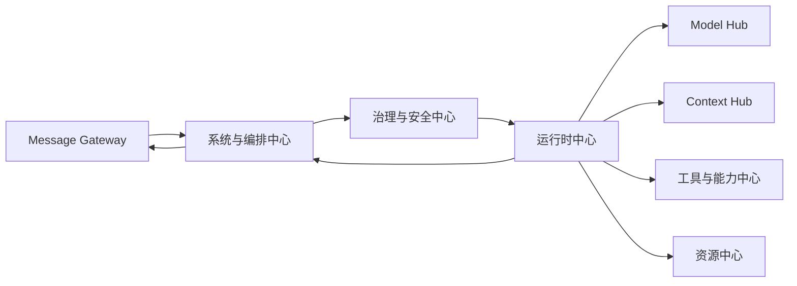
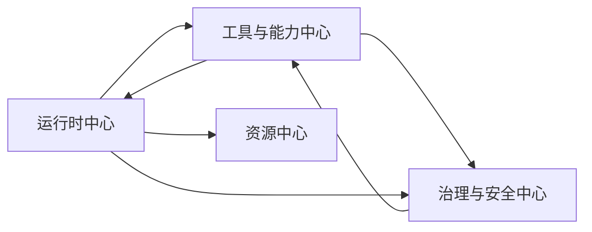
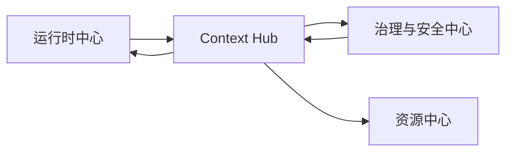
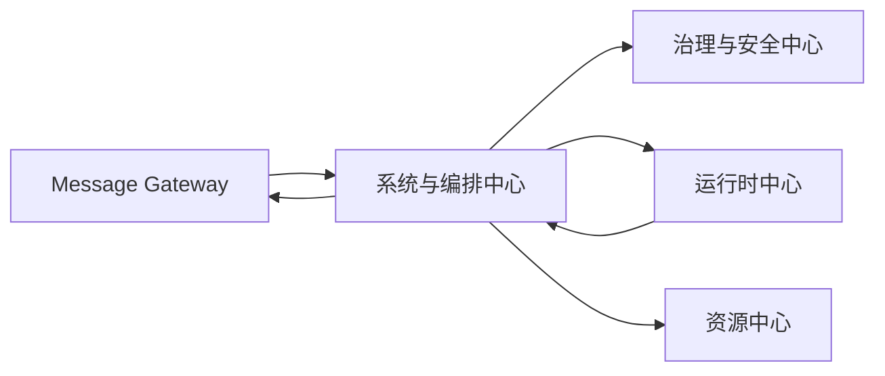

# **QuarkfanTools 平台中心参考矩阵与拆解规划**

本文用于指导 QuarkfanTools 后续平台化拆分时的开源项目参考方式。

核心原则不是为每个中心找一个“唯一模板”，而是为每个中心拆出若干子能力，并分别寻找成熟项目进行建模参考。每个参考项目只解决一部分问题，不应整体照搬其产品形态、部署方式或历史包袱。

---

## **1. 总体原则**

QuarkfanTools 后续将由八个独立中心组成：

1. Message Gateway，消息网关
2. Context Hub（CH，上下文中心）
3. Model Hub（MH，模型枢纽）
4. 工具与能力中心
5. 运行时中心
6. 资源中心
7. 系统与编排中心
8. 治理与安全中心

每个中心应作为独立项目推进，但“独立项目”不等于立即独立进程、独立服务或独立部署。建议按以下阶段演进：

```text
阶段一：独立目录 / 独立 package
阶段二：独立 npm workspace package
阶段三：必要时独立进程或本地服务
阶段四：必要时支持远端部署或多实例
```

各中心之间不直接依赖内部实现，应通过统一协议包连接：

```text
quarkfan-platform-protocol
```

协议包中放置：

```text
Message DTO
Runtime DTO
Context DTO
Capability DTO
Model DTO
Governance DTO
Resource DTO
Workflow DTO
Error Code
Audit Event
Trace Context
```

---

## **2. 参考项目使用原则**

每个开源项目只作为局部参考，不能整体照搬。

|**类型**|**使用方式**|
|---|---|
|主参考项目|用于建立该中心的主要领域模型和核心接口|
|子能力参考项目|用于补充某个局部能力，例如消息游标、模型路由、权限判断、流程恢复|
|反向参考项目|用于识别不该做什么，避免引入过重产品形态|
|协议参考项目|用于参考接口边界、事件模型、权限模型和扩展机制|

后续阅读开源项目时，不应只看 README，而应重点看：

```text
领域对象
数据库模型
核心接口
事件定义
生命周期
权限判断
错误处理
可观测性
测试用例
配置结构
```

---

## **3. 总体参考矩阵**

|**中心**|**主参考**|**子能力参考**|**主要借鉴点**|**明确不照搬**|
|---|---|---|---|---|
|Message Gateway|Chatwoot|Matrix / Synapse、OpenClaw、Mattermost|多通道接入、会话、消息、收件箱、联系人、投递|客服工单、CRM、坐席体系|
|Context Hub（CH）|AnythingLLM|Open WebUI、Dify、LlamaIndex、LangChain、Haystack、Mem0/OpenMemory、Letta、Zep/Graphiti、LangGraph/LangMem|文档接入、知识库、RAG、索引、召回、workspace、短期/中期/长期记忆、事实沉淀、记忆遗忘|完整聊天产品、应用市场、自动无治理写入长期记忆|
|Model Hub（MH）|LiteLLM|Open WebUI、Dify、Ollama、vLLM、LM Studio、ComfyUI、Stable Diffusion WebUI、InvokeAI、Diffusers|Provider、Router、Fallback、Quota、Cost、Key 管理、本地模型、自托管推理、图像生成/编辑、语音和多模态模型能力|Agent runtime、session、workspace、工具编排|
|工具与能力中心|MCP|Dify Plugin、Open WebUI Pipelines、LangChain Tools、Composio|工具协议、能力声明、插件、外部系统连接|发现即信任、直接暴露全部工具|
|运行时中心|OpenHands|Claude Code、Aider、Open Interpreter、Anthropic Sandbox Runtime|sandbox、workspace、session、event stream、工具执行|只做 coding agent|
|资源中心|AnythingLLM Desktop / Open WebUI|Electron Store、VS Code、Logseq、Obsidian|本地资源、缓存、日志、诊断包、清理策略|聊天历史中心、知识库中心|
|系统与编排中心|Temporal|LangGraph、n8n、BullMQ、Agenda、Airflow|durable execution、retry、checkpoint、schedule、workflow|重型服务端部署、全量流程图化|
|治理与安全中心|OpenFGA|OPA、Casbin、Zanzibar、MCP Security、Kubernetes RBAC|ReBAC、策略判断、授权模型、审计、审批|只做 RBAC、只做静态权限表|

---

# **4. Message Gateway 参考规划**

## **4.1 中心定位**

Message Gateway 负责消息基础设施，不负责 Agent、runtime、模型或知识。

它处理：

```text
消息源接入
消息标准化
发送人识别
会话识别
通道识别
游标管理
订阅管理
历史查询
出站投递
消息去重
消息回路控制
```

Chatwoot 适合作为主参考，因为它本身是开源多通道客户支持平台，核心能力就是把网站、邮件、社交媒体和消息平台中的会话集中到一个地方管理。Chatwoot 官方也强调它支持在一个地方处理来自 website、email、social media 和 messaging platforms 的客户会话。([Chatwoot](https://www.chatwoot.com/?utm_source=chatgpt.com))

## **4.2 子能力参考矩阵**

|**子能力**|**参考项目**|**参考内容**|**QuarkfanTools 中的落点**|
|---|---|---|---|
|多消息源接入|Chatwoot|Inbox、Channel、Conversation|MessageSource、Channel、Conversation|
|消息协议标准化|Matrix / Synapse|Event、Room、Timeline、Sync|NormalizedMessage、MessageEvent|
|会话归属|Chatwoot|Contact、ContactInbox、Conversation|Sender、SenderBinding、Conversation|
|历史消息与游标|Matrix / Synapse|timeline、pagination、sync token|MessageCursor、HistoryQuery|
|出站投递|Chatwoot|outbound message、channel adapter|Delivery、DeliveryTarget|
|消息回路控制|OpenClaw 思路|channel / sink / loop guard|MessageLoopGuard|
|IM 团队协作消息|Mattermost|channel、thread、post|group chat、thread、message tree|
|Webhook 接入|GitHub Webhook / Slack Events|event envelope、signature、retry|WebhookSource、EventVerify|

## **4.3 推荐领域对象**

```text
GatewayAccount
MessageSource
Channel
Sender
SenderChannelBinding
Conversation
Message
MessageResource
MessageCursor
MessageSubscription
MessageDelivery
DeliveryTarget
MessageLoopGuard
MessageTrace
```

## **4.4 首批接口**

```ts
interface MessageSourceAdapter {
  pull(cursor?: MessageCursor): Promise<MessageBatch>
  subscribe(handler: MessageEventHandler): Promise<SubscriptionHandle>
}

interface MessageGateway {
  normalize(raw: RawMessage): Promise<NormalizedMessage>
  queryHistory(request: HistoryQuery): Promise<MessageBatch>
  deliver(request: DeliveryRequest): Promise<DeliveryResult>
}
```

## **4.5 禁止事项**

```text
MG 不执行 Agent
MG 不决定模型
MG 不读取知识库
MG 不决定工具权限
MG 不解释 reaction 业务语义
MG 不直接持有 runtime session
```

## **4.6 推进优先级**

|**优先级**|**内容**|
|---|---|
|P0|统一 Message、Conversation、Sender、Channel、Cursor|
|P1|飞书 Bot adapter 重构到 MessageSourceAdapter|
|P1|出站投递 Delivery 抽象|
|P2|消息订阅、周期拉取、历史查询统一|
|P2|MessageLoopGuard|
|P3|企业微信、钉钉、Webhook、CLI 接入|

---

# **5. Context Hub（CH）参考规划**

## **5.1 中心定位**

Context Hub 负责上下文源、知识索引、上下文召回、记忆分层和权限范围。它不负责最终回复，也不直接执行工具。知识库是 CH 的一部分；短期记忆、中期记忆和长期记忆也是 CH 的核心职责。

AnythingLLM 适合作为知识与本地优先主参考，因为它强调本地优先，文档、聊天、模型等可本地存储；同时支持文档接入、向量数据库和 document pipelines。([AnythingLLM](https://anythingllm.com/?utm_source=chatgpt.com))

Open WebUI 也适合作为知识权限和 RAG 辅助参考，它定位为可离线运行的自托管 AI 平台，并内置 RAG inference engine。([GitHub](https://github.com/open-webui/open-webui?utm_source=chatgpt.com))

记忆方向需要补充第二批源码级参考：Mem0 / OpenMemory、Letta、Zep / Graphiti、LangGraph / LangMem。它们用于参考用户记忆、agent memory、temporal graph memory、checkpoint memory 和长期存储命名空间。

## **5.2 子能力参考矩阵**

|**子能力**|**参考项目**|**参考内容**|**QuarkfanTools 中的落点**|
|---|---|---|---|
|本地知识库|AnythingLLM|workspace、documents、vector DB|ContextCollection|
|文档管道|AnythingLLM|document pipeline|DocumentIngestionPipeline|
|RAG 召回|Open WebUI|RAG engine、knowledge|ContextRetriever|
|知识源连接器|Dify / AnythingLLM|connectors、dataset source|ContextSourceAdapter|
|索引框架|LlamaIndex|document、node、index、retriever|ContextIndex、ContextChunk|
|通用检索链路|LangChain|retriever、document loader|RetrieverAdapter|
|企业检索|Haystack|pipeline、retriever、ranker|RetrievalPipeline|
|短期记忆|LangGraph / LangMem|checkpoint、thread state、memory store|ShortTermContext|
|中期记忆|Mem0 / OpenMemory|memory extraction、scoring、user memory|ContextMemoryCandidate|
|长期记忆|Letta、Zep / Graphiti|archival memory、entity、relationship、temporal fact|LongTermMemory、ContextGraph|
|freshness / 快照|自研为主|version、snapshot、mtime|ContextSnapshot|

## **5.3 推荐领域对象**

```text
ContextSource
ContextCollection
ContextDocument
ContextChunk
ContextIndex
ContextRetriever
ContextRetrieveRequest
ContextRetrieveResult
ContextMemory
ContextFreshnessKey
ContextPermissionScope
ContextAuditRecord
```

## **5.4 首批接口**

```ts
interface ContextSourceAdapter {
  list(request: ContextSourceListRequest): Promise<ContextSourceItem[]>
  fetch(request: ContextFetchRequest): Promise<ContextSourceContent>
  freshness(request: ContextFreshnessRequest): Promise<ContextFreshness>
}

interface ContextRetriever {
  retrieve(request: ContextRetrieveRequest): Promise<ContextRetrieveResult>
}

interface ContextMemoryWriter {
  propose(request: MemoryProposeRequest): Promise<MemoryCandidate[]>
  confirm(request: MemoryConfirmRequest): Promise<ContextMemory>
  forget(request: MemoryForgetRequest): Promise<void>
}
```

## **5.5 召回结果必须包含**

```text
来源
标题
摘要
chunk
权限范围
更新时间
freshness key
是否可进入模型上下文
审计信息
```

## **5.6 禁止事项**

```text
CH 不直接回复用户
CH 不执行工具
CH 不绕过治理读取上下文或写入长期记忆
CH 不直接操作 runtime workspace
CH 不把所有文件缓存、日志、transcript 都纳入自己管理
CH 不允许模型自动无治理写入长期记忆
```

## **5.7 推进优先级**

|**优先级**|**内容**|
|---|---|
|P0|ContextSource、ContextRecord、ContextMemory、ContextRetrieveResult|
|P1|Skill knowledge 统一接入|
|P1|飞书文档统一接入|
|P1|短期 / 中期记忆候选|
|P2|本地文件知识库|
|P2|召回结果审计|
|P3|向量库、rerank、知识图谱、长期记忆图谱|

---

# **6. Model Hub（MH）参考规划**

## **6.1 中心定位**

Model Hub 负责模型服务，不负责运行时。它不只管理大语言模型，也管理 embedding、rerank、vision、speech-to-text、TTS、image generation、image editing、Stable Diffusion 类模型、本地模型和自托管推理服务。

LiteLLM 是 provider/routing/fallback/cost 方向最适合的主参考。它是开源 AI Gateway，提供统一接口调用 100+ LLM provider，并支持 spend tracking、guardrails、load balancing、cost tracking、project/user 级 spend management、virtual keys、retry/fallback 等能力。([GitHub](https://github.com/BerriAI/litellm?utm_source=chatgpt.com))

但 MH 不能只按 LLM 建模，图像、语音、多模态、本地模型和自托管推理需要补充参考：Ollama / LM Studio 负责本地模型形态，vLLM 负责自托管 serving，ComfyUI / Stable Diffusion WebUI / InvokeAI / Diffusers 负责 image generation 和 diffusion pipeline 能力描述。

## **6.2 子能力参考矩阵**

|**子能力**|**参考项目**|**参考内容**|**QuarkfanTools 中的落点**|
|---|---|---|---|
|多 provider 接入|LiteLLM|provider abstraction|ModelProvider|
|模型路由|LiteLLM|Router、model group|ModelRouter|
|失败切换|LiteLLM|retry、fallback、cooldown|FallbackPolicy|
|预算与成本|LiteLLM|spend tracking、budget|ModelUsage、ModelCost|
|Key 管理|LiteLLM|virtual key|ModelCredential|
|本地模型管理|Ollama|local model pull/run/list|LocalModelProvider|
|推理服务|vLLM|serving、batching、OpenAI API|SelfHostedModelDeployment|
|桌面模型|LM Studio|local runtime、OpenAI compatible API|DesktopModelProvider|
|UI 配置|Open WebUI / Dify|provider config、model config|ModelSettings UI|
|图像生成工作流|ComfyUI|workflow graph、node capabilities、checkpoint/LoRA/resource refs|ImageGenerationDeployment、ModelCapabilityExport|
|Stable Diffusion 管理|Stable Diffusion WebUI / InvokeAI|model catalog、sampler/options、API、queue/gallery|DiffusionModelProvider|
|扩散模型库|Diffusers|pipeline、scheduler、adapter、local model assets|DiffusionPipelineAdapter|

## **6.3 推荐领域对象**

```text
ModelProvider
ModelDeployment
ModelCredential
ModelCapability
ModelRouter
ModelRoutingPolicy
ModelFallbackPolicy
ModelHealthCheck
ModelQuota
ModelUsageRecord
ModelCostRecord
ModelInvocationTrace
ModelCapabilityExport
LocalModelProcess
SelfHostedModelDeployment
```

## **6.4 首批接口**

```ts
interface ModelHub {
  listAvailableModels(context: ModelSelectContext): Promise<ModelCandidate[]>
  selectModel(request: ModelSelectRequest): Promise<ModelSelection>
  recordUsage(record: ModelUsageRecord): Promise<void>
  listCapabilityExports(request: ModelCapabilityExportRequest): Promise<ModelCapabilityExport[]>
}
```

## **6.5 禁止事项**

```text
MH 不管理 Agent session
MH 不管理 workspace
MH 不注入 MCP
MH 不注册或编排工具
MH 不构造最终 prompt
MH 不等于 runtime
MH 不把所有模型都当作 chat LLM
```

## **6.6 推进优先级**

|**优先级**|**内容**|
|---|---|
|P0|ModelProvider、ModelDeployment、ModelCapability|
|P1|provider 配置校验|
|P1|fallback / retry|
|P2|token / cost 统计|
|P2|健康检查|
|P2|ModelCapabilityExport 给工具中心封装模型能力|
|P3|local model / self-hosted model / diffusion serving|

---

# **7. 工具与能力中心参考规划**

## **7.1 中心定位**

工具与能力中心负责“平台有什么能力”，治理中心负责“某场景能不能用”。

MCP 是最重要参考。MCP 官方将其定义为连接 AI 应用与外部系统的开源标准，覆盖 data sources、tools 和 workflows。([GitHub](https://github.com/anthropic-experimental/sandbox-runtime?utm_source=chatgpt.com))

## **7.2 子能力参考矩阵**

|**子能力**|**参考项目**|**参考内容**|**QuarkfanTools 中的落点**|
|---|---|---|---|
|工具协议|MCP|tool、resource、prompt、server、client|CapabilityProvider|
|能力声明|MCP / Dify Plugin|schema、metadata、tool definition|CapabilityManifest|
|插件安装|Dify Plugin|plugin package、market、version|CapabilityPackage|
|可插拔管道|Open WebUI Pipelines|pipeline、filter、function|CapabilityPipeline|
|工具封装|LangChain Tools|tool interface、tool schema|ToolCapability|
|外部 SaaS 集成|Composio|app integration、auth、tool catalog|ExternalCapabilityConnector|
|命令能力|自研 + shell wrapper|executable、args、env|ExecutableCapability|
|Skill 能力|Claude Code Skill|skill、instruction、knowledge|SkillCapability|

## **7.3 推荐领域对象**

```text
Capability
CapabilityManifest
CapabilityProvider
CapabilityPackage
CapabilityBinding
CapabilityInputSchema
CapabilityOutputSchema
CapabilityRuntimeRequirement
CapabilityPermissionRequirement
CapabilityVersion
CapabilityInstallRecord
CapabilityDiagnostics
```

## **7.4 首批接口**

```ts
interface CapabilityRegistry {
  register(manifest: CapabilityManifest): Promise<CapabilityRegisterResult>
  list(request: CapabilityListRequest): Promise<Capability[]>
  resolve(request: CapabilityResolveRequest): Promise<CapabilityBinding>
}
```

## **7.5 能力声明必须包含**

```text
能力 ID
能力类型
来源
版本
输入 schema
输出 schema
运行时要求
权限要求
风险等级
是否需要审批
是否允许进入模型上下文
是否允许外部投递
诊断方式
```

## **7.6 禁止事项**

```text
工具中心不决定授权
工具中心不默认信任 MCP server
工具中心不直接扩大 Bot 权限
工具中心不直接执行 runtime
工具中心不持有 IM 消息生命周期
```

## **7.7 推进优先级**

|**优先级**|**内容**|
|---|---|
|P0|CapabilityManifest|
|P1|Skill / MCP / executable 三类能力统一登记|
|P1|CapabilityBinding|
|P2|CapabilityDiagnostics|
|P2|插件安装、升级、卸载|
|P3|能力市场、远端能力源|

---

# **8. 运行时中心参考规划**

## **8.1 中心定位**

运行时中心负责“怎么执行”，而不是“有什么能力”或“用哪个模型”。

OpenHands 是主参考。OpenHands 官方定位为开源、模型无关的 cloud coding agents 平台，其 SDK 可以定义 agent 并在本地或云端运行。([GitHub](https://github.com/OpenHands/openhands?utm_source=chatgpt.com)) OpenHands 论文也强调它支持不同 LLM、安全 sandbox 环境、命令行、浏览器等交互方式。([OpenReview](https://openreview.net/forum?id=OJd3ayDDoF&utm_source=chatgpt.com))

Anthropic Sandbox Runtime 也值得关注，它明确定位为面向 Claude Code 的安全 AI agent sandbox research preview。([GitHub](https://github.com/anthropic-experimental/sandbox-runtime?utm_source=chatgpt.com))

## **8.2 子能力参考矩阵**

|**子能力**|**参考项目**|**参考内容**|**QuarkfanTools 中的落点**|
|---|---|---|---|
|Agent runtime|OpenHands|agent loop、runtime、event stream|AgentRuntime|
|sandbox|OpenHands / Anthropic Sandbox Runtime|文件、命令、隔离、安全执行|RuntimeSandbox|
|workspace|OpenHands / Claude Code|workspace、repo、session file|RuntimeWorkspace|
|session 恢复|OpenHands / Claude Code|session state、resume|RuntimeSession|
|工具调用事件|OpenHands|action、observation、event|RuntimeEvent|
|代码编辑型 runtime|Aider|repo editing、diff、git|CodeRuntimeAdapter|
|本机操作型 runtime|Open Interpreter|local execution、shell|LocalExecutionRuntime|
|Claude Code 适配|Claude Code|skill、mcp、session|ClaudeCodeRuntime|
|纯文本 runtime|LiteLLM / OpenAI-compatible|stateless text call|TextRuntime|

## **8.3 推荐领域对象**

```text
AgentRuntime
RuntimeAdapter
RuntimeContext
RuntimeSession
RuntimeWorkspace
RuntimeEvent
RuntimeToolCall
RuntimeResult
RuntimeError
RuntimeSandbox
RuntimePermission
RuntimeTrace
```

## **8.4 首批接口**

```ts
interface AgentRuntime {
  id: string
  capabilities: RuntimeCapability[]

  run(request: RuntimeRunRequest): AsyncIterable<RuntimeEvent>
  resume(request: RuntimeResumeRequest): AsyncIterable<RuntimeEvent>
  cancel(sessionId: string): Promise<void>
}
```

## **8.5 统一事件模型**

```text
RuntimeStarted
RuntimeProgress
RuntimeMessageDelta
RuntimeToolCallStarted
RuntimeToolCallFinished
RuntimeFileAccessed
RuntimeSessionUpdated
RuntimeFinalResult
RuntimeError
RuntimeCancelled
```

## **8.6 禁止事项**

```text
运行时中心不直接读取消息源内部状态
运行时中心不决定知识是否授权
运行时中心不决定工具是否授权
运行时中心不管理模型 provider 策略
运行时中心不直接清理用户资产
```

## **8.7 推进优先级**

|**优先级**|**内容**|
|---|---|
|P0|AgentRuntime 接口|
|P1|ClaudeCodeRuntime 包装现有 runClaude|
|P1|RuntimeEvent 统一|
|P2|RuntimeWorkspace 抽象|
|P2|RuntimeSession resume|
|P3|TextRuntime、VisionRuntime、LocalRuntime|

---

# **9. 资源中心参考规划**

## **9.1 中心定位**

资源中心管理平台运行过程中产生和消耗的本地资源，不等于 CH，也不等于聊天历史中心或记忆中心。

AnythingLLM 和 Open WebUI 都可以作为本地化资源组织参考。AnythingLLM 强调 local by default，模型、文档、聊天等都可以存储在本地桌面。([AnythingLLM](https://anythingllm.com/?utm_source=chatgpt.com)) Open WebUI 则强调自托管、可离线运行。([GitHub](https://github.com/open-webui/open-webui?utm_source=chatgpt.com))

## **9.2 子能力参考矩阵**

|**子能力**|**参考项目**|**参考内容**|**QuarkfanTools 中的落点**|
|---|---|---|---|
|本地数据目录|AnythingLLM Desktop|local app data、documents、models|ResourceLayout|
|配置存储|Electron Store|config persistence|ConfigResource|
|日志管理|VS Code / Electron apps|log rotation、log level|LogResource|
|排障包|VS Code|diagnostics export|DiagnosticsBundle|
|文件缓存|Open WebUI / AnythingLLM|upload、cache、document file|FileCache|
|session 存储|OpenHands / Claude Code|session、workspace|SessionResource|
|清理策略|浏览器 / IDE|cache cleanup、safe deletion|RetentionPolicy|
|插件资源|VS Code|extension directory|CapabilityResource|

## **9.3 推荐资源分类**

```text
配置资源
- Bot 配置
- 模型配置
- 授权配置
- 用户偏好

运行资源
- session
- workspace
- runtime logs
- task history

缓存资源
- 下载文件
- 文档快照
- 索引缓存
- 临时文件

诊断资源
- 日志包
- 错误报告
- 运行轨迹
- 系统状态快照

用户资产
- 用户 Skill
- 用户知识源
- 用户应用
- 用户授权
```

## **9.4 推荐领域对象**

```text
ResourceInventory
ResourceItem
ResourceUsage
ResourceQuota
RetentionPolicy
CleanupPlan
CleanupResult
DiagnosticsBundle
ResourceExport
ResourceHealthReport
```

## **9.5 首批接口**

```ts
interface ResourceCenter {
  inspect(request: ResourceInspectRequest): Promise<ResourceInventory>
  planCleanup(request: CleanupPlanRequest): Promise<CleanupPlan>
  executeCleanup(planId: string): Promise<CleanupResult>
  exportDiagnostics(request: DiagnosticsExportRequest): Promise<DiagnosticsBundle>
}
```

## **9.6 禁止事项**

```text
资源中心不决定业务策略
资源中心不自动删除用户资产
资源中心不管理知识语义
资源中心不执行工具
资源中心不绕过治理读取敏感文件
```

## **9.7 推进优先级**

|**优先级**|**内容**|
|---|---|
|P0|ResourceInventory|
|P1|日志、缓存、session 分类|
|P1|排障包导出|
|P2|清理计划预览|
|P2|保守自动清理|
|P3|quota、成本、健康报告|

---

# **10. 系统与编排中心参考规划**

## **10.1 中心定位**

系统与编排中心负责平台生命周期、后台任务、定时任务、长期任务、状态恢复和流程编排。

Temporal 适合作为主参考，因为它是 durable execution 平台，支持 Workflows，并自动处理间歇性失败和重试。([GitHub](https://github.com/temporalio/temporal?utm_source=chatgpt.com))

LangGraph 适合作为 Agent Flow 的参考，不适合作为整个系统调度中心的唯一参考。LangGraph persistence 文档说明 checkpointer 可以持久化 graph state，用于 conversation continuity、human-in-the-loop、time travel 和 fault tolerance。([Docs by LangChain](https://docs.langchain.com/oss/python/langgraph/persistence?utm_source=chatgpt.com))

## **10.2 子能力参考矩阵**

|**子能力**|**参考项目**|**参考内容**|**QuarkfanTools 中的落点**|
|---|---|---|---|
|durable execution|Temporal|workflow、activity、retry、timeout|DurableTask|
|定时任务|Temporal Schedule / Agenda|schedule、cron、calendar|ScheduledTask|
|本地队列|BullMQ|queue、job、retry、backoff|TaskQueue|
|Agent Flow|LangGraph|state graph、checkpoint、resume|FlowEngine|
|Human-in-the-loop|LangGraph|interrupt、approval、resume|ApprovalNode|
|自动化流程|n8n|workflow node、trigger、action|AutomationWorkflow|
|数据任务编排|Airflow|DAG、task、dependency|BatchWorkflow|
|应用生命周期|Electron / 自研|startup、shutdown、migration|SystemLifecycle|

## **10.3 推荐内部结构**

```text
SystemLifecycle
- app start
- config load
- auth gate
- migration
- shutdown

TaskScheduler
- scheduled task
- queue
- retry
- backoff
- cancellation

FlowEngine
- state graph
- checkpoint
- human approval
- long-running workflow

RecoveryManager
- crash recovery
- network recovery
- history catch-up
- pending task resume
```

## **10.4 推荐领域对象**

```text
SystemLifecycleEvent
Task
TaskRun
TaskQueue
TaskRetryPolicy
TaskSchedule
Workflow
WorkflowRun
WorkflowState
WorkflowCheckpoint
WorkflowSignal
WorkflowQuery
WorkflowCancellation
FlowNode
FlowEdge
```

## **10.5 首批接口**

```ts
interface OrchestrationCenter {
  submitTask(request: TaskSubmitRequest): Promise<TaskRun>
  scheduleTask(request: TaskScheduleRequest): Promise<TaskSchedule>
  startWorkflow(request: WorkflowStartRequest): Promise<WorkflowRun>
  signalWorkflow(request: WorkflowSignalRequest): Promise<void>
  cancelRun(runId: string): Promise<void>
}
```

## **10.6 禁止事项**

```text
系统与编排中心不直接执行 runtime
系统与编排中心不绕过治理触发能力
系统与编排中心不直接读取知识库
系统与编排中心不把所有系统任务都图化
系统与编排中心不持有模型 provider 细节
```

## **10.7 推进优先级**

|**优先级**|**内容**|
|---|---|
|P0|Task、TaskRun、TaskQueue|
|P1|定时任务统一|
|P1|补处理、长任务提示、reaction 策略迁移|
|P2|retry、backoff、cancellation|
|P2|FlowEngine 最小实现|
|P3|LangGraph 风格 checkpoint / human-in-the-loop|

---

# **11. 治理与安全中心参考规划**

## **11.1 中心定位**

治理与安全中心负责授权判断、策略解释、审批、审计、脱敏和风险控制。

OpenFGA 是主参考。OpenFGA 是开源细粒度授权系统，支持通过易读建模语言和 API 构建 granular access control。([OpenFGA](https://openfga.dev/?utm_source=chatgpt.com)) OpenFGA 文档说明 ReBAC 会根据用户与对象、对象与对象之间的关系决定访问权限，例如用户能访问某文档是因为他能访问父文件夹。([OpenFGA](https://openfga.dev/docs/authorization-concepts?utm_source=chatgpt.com))

## **11.2 子能力参考矩阵**

|**子能力**|**参考项目**|**参考内容**|**QuarkfanTools 中的落点**|
|---|---|---|---|
|关系式授权|OpenFGA|subject、object、relation、tuple|AuthorizationModel|
|策略表达|OPA|policy as code、Rego|PolicyRule|
|简单权限模型|Casbin|RBAC、ABAC、ACL|LightweightPolicy|
|Zanzibar 模型|Zanzibar / OpenFGA|relation tuple、check|PermissionCheck|
|MCP 安全|MCP Security Best Practices|tool trust、server risk|ToolSecurityPolicy|
|沙箱策略|Kubernetes RBAC / Pod Security|scope、resource、verb|SandboxPolicy|
|审计|Cloud audit log 思路|actor、action、resource、decision|AuditRecord|
|审批|GitHub PR / Slack approval|request、approve、reject|ApprovalFlow|

## **11.3 推荐领域对象**

```text
Subject
Resource
Action
Relation
Policy
Grant
Decision
DecisionReason
AuditRecord
ApprovalRequest
ApprovalDecision
RiskLevel
SandboxPolicy
RedactionPolicy
ToolSecurityPolicy
KnowledgeAccessPolicy
MessageDeliveryPolicy
```

## **11.4 首批接口**

```ts
interface GovernanceCenter {
  check(request: PolicyCheckRequest): Promise<PolicyDecision>
  audit(record: AuditRecord): Promise<void>
  requestApproval(request: ApprovalRequest): Promise<ApprovalTicket>
  redact(request: RedactionRequest): Promise<RedactionResult>
}
```

## **11.5 必须覆盖的判断点**

```text
某 Bot 是否允许处理某消息
某 Bot 是否允许调用某能力
某 runtime 是否允许访问某 workspace
某能力是否允许读取某文件
某知识源是否允许召回
某 MCP server 是否可信
某工具调用是否需要 Owner 审批
某结果是否允许投递到某通道
某日志是否需要脱敏
某排障包是否允许导出
```

## **11.6 禁止事项**

```text
治理中心不执行业务能力
治理中心不替代工具中心做能力发现
治理中心不替代资源中心做存储统计
治理中心不只做 RBAC
治理中心不只记录日志而不做运行前判定
```

## **11.7 推进优先级**

|**优先级**|**内容**|
|---|---|
|P0|PolicyCheck、AuditRecord|
|P1|Bot / Channel / Capability 授权|
|P1|文件访问策略|
|P2|MCP 安全策略|
|P2|Owner 审批|
|P3|OpenFGA 风格关系模型|

---

# **12. 中心之间的最小协作链路**

## **12.1 消息进入链路**



## **12.2 工具调用链路**



## **12.3 上下文召回链路**



## **12.4 长任务链路**



---

# **13. 推荐推进顺序**

## **13.1 第一阶段：切出最容易继续膨胀的模块**

|**顺序**|**中心**|**原因**|
|---|---|---|
|1|Message Gateway|消息源、会话、游标、投递继续堆在主链路会失控|
|2|运行时中心|当前 Claude 适配层最厚，后续最容易膨胀|
|3|治理与安全中心|MCP、Skill、文件访问扩张后再补治理成本很高|

## **13.2 第二阶段：切出能力与模型**

|**顺序**|**中心**|**原因**|
|---|---|---|
|4|Model Hub|provider、fallback、usage、cost、非 LLM 模型能力可以独立沉淀|
|5|工具与能力中心|Skill、MCP、自定义应用、Workflow 需要统一能力声明|

## **13.3 第三阶段：切出知识、资源、编排**

|**顺序**|**中心**|**原因**|
|---|---|---|
|6|Context Hub|等权限和 runtime 边界稳定后再统一 RAG、记忆和上下文治理更稳|
|7|资源中心|日志、缓存、排障包和清理策略可逐步下沉|
|8|系统与编排中心|先收敛 task，再逐步引入 FlowEngine|

---

# **14. 每个中心的首批交付物**

|**中心**|**首批交付物**|
|---|---|
|Message Gateway|Message、Conversation、Channel、Cursor、Delivery|
|Context Hub|ContextSource、ContextRecord、ContextRetriever、ContextMemoryWriter|
|Model Hub|ModelProvider、ModelDeployment、ModelRouter、ModelCapabilityExport|
|工具与能力中心|CapabilityManifest、CapabilityRegistry、CapabilityBinding|
|运行时中心|AgentRuntime、RuntimeContext、RuntimeEvent|
|资源中心|ResourceInventory、CleanupPlan、DiagnosticsBundle|
|系统与编排中心|Task、TaskRun、TaskQueue、Schedule|
|治理与安全中心|PolicyCheck、PolicyDecision、AuditRecord|

---

# **15. 阅读开源项目时的统一检查表**

每看一个参考项目，都用以下清单记录：

```text
1. 它解决的核心问题是什么？
2. 它的领域对象有哪些？
3. 它的核心表结构或状态模型是什么？
4. 它的接口边界是什么？
5. 它如何处理插件、扩展或 adapter？
6. 它如何处理权限？
7. 它如何处理错误？
8. 它如何处理重试？
9. 它如何处理审计和日志？
10. 它有哪些产品包袱不适合 QuarkfanTools？
11. 哪些模型可以直接借鉴？
12. 哪些模型只能作为反例？
```

---

# **16. 最终建议**

QuarkfanTools 的平台化不应理解为“把一个 Agent 调用链拆成八个目录”，而应理解为：

```text
把本机 Agent 平台拆成八套可独立建模、独立演进、通过协议连接的基础设施。
```

因此，每个中心都需要多个参考对象：

```text
一个项目用于主领域模型
一个项目用于接口边界
一个项目用于权限或安全
一个项目用于运行和可观测
一个项目用于识别不该照搬的产品包袱
```

当前最值得优先深入源码的项目是：

```text
Chatwoot
LiteLLM
OpenHands
OpenFGA
AnythingLLM
Temporal
LangGraph
MCP ecosystem
```

其中：

```text
Chatwoot 解决消息和会话建模
LiteLLM 解决模型网关建模
OpenHands 解决 runtime 和 sandbox 建模
OpenFGA 解决治理授权建模
AnythingLLM 解决知识和本地资源组织
Temporal 解决长期任务和可靠执行语义
LangGraph 解决 Agent Flow 和 checkpoint 语义
MCP 解决工具协议和能力连接
```

这份参考矩阵应作为后续每个中心立项、拆包、设计接口和阅读源码时的入口文档。
